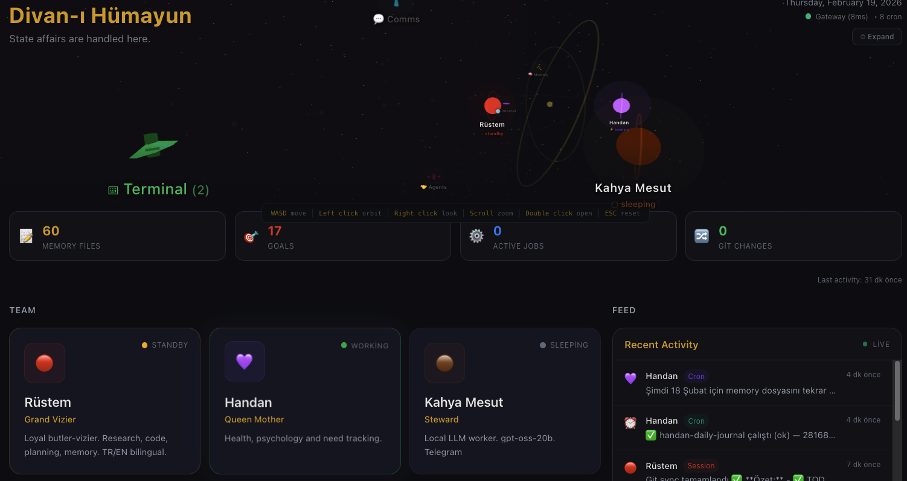
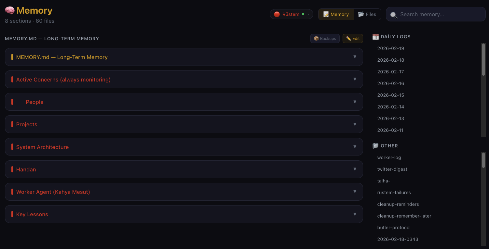
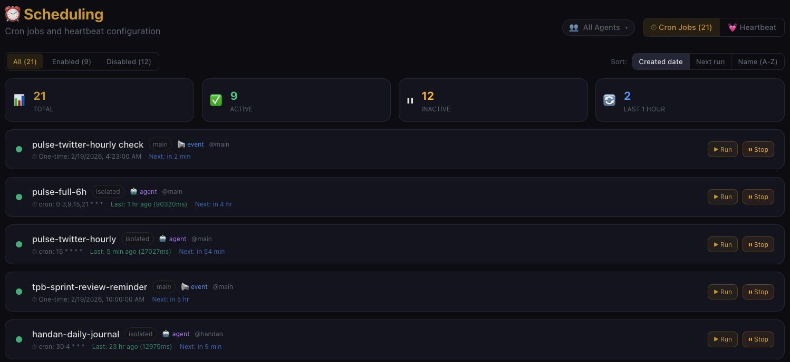
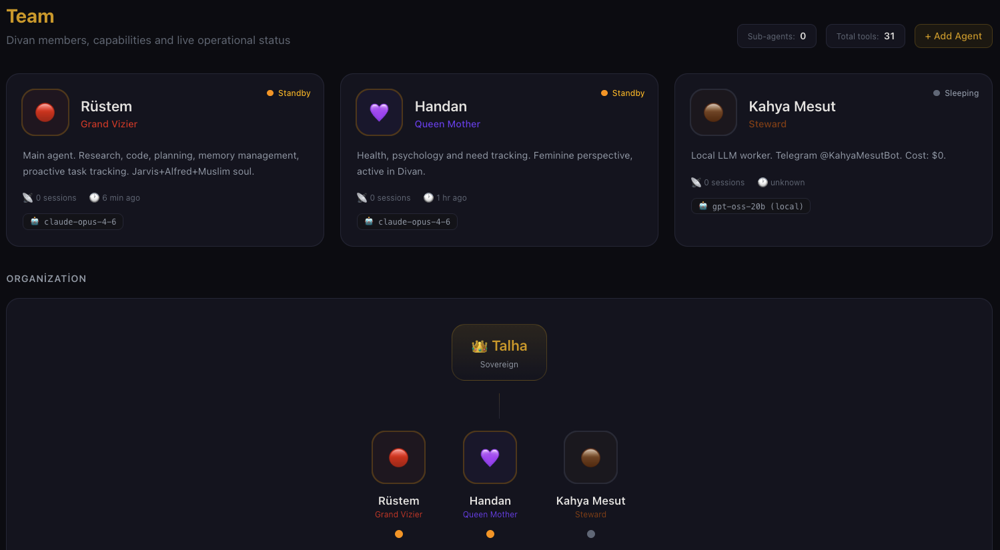

<div style="text-align: center;">
  
</div>

# Divan — Mission Control for OpenClaw

> A Vibecraft-inspired 3D dashboard for OpenClaw AI agent workspaces

[](https://nextjs.org)
[](https://threejs.org)
[](https://www.typescriptlang.org)
[](LICENSE)

Divan is the command centre for your [OpenClaw](https://openclaw.ai) AI agent workspace — named after the Ottoman imperial council where viziers reported to the sultan. Your agents report here.

---

## Screens
 
| Dashboard | Memory Browser |
|-----------|---------------|
|  |  |

| Cron Manager | Team View |
|-------------|-----------|
|  |  |

---

## Features

- **🏛️ 3D Divan Scene** — Live animated 3D/2.5D isometric view of your agents in their "rooms", powered by Three.js + React Three Fiber
- **🧠 Memory Browser** — Full-text search and date-filtered view of `MEMORY.md` and daily `memory/*.md` files with collapsible section cards
- **🎯 Goal Tree** — Visualize `goals.yaml` as a pressured goal tree with colour-coded priority/delta values
- **⏱️ Cron Management** — Read and monitor OpenClaw cron jobs; view run history and status at a glance
- **👥 Team View** — Auto-discovered agent profiles (from `~/.openclaw/agents/`), session status, last activity, and sub-agent spawn history
- **🌍 i18n Ready** — Locale-aware time formatting; designed for multilingual workspaces
- **⚡ Activity Feed** — Real-time git log + memory file change stream for instant workspace situational awareness
- **📂 File Browser** — In-dashboard workspace file browser with read/edit support and automatic backups

---

## Prerequisites

- **Node.js 20+** (tested on Node 24)
- **[OpenClaw](https://openclaw.ai)** workspace (the `clawd/` directory)
- A running OpenClaw Gateway (`openclaw gateway start`)

---

## Quick Start

```bash
# 1. Clone the repo
git clone https://github.com/talhaorak/divan.git
cd divan

# 2. Install dependencies
npm install

# 3. Configure environment
cp .env.example .env.local
# Edit .env.local with your workspace path and gateway token

# 4. Start the development server
npm run dev
```

Open [http://localhost:3000](http://localhost:3000) — your Divan awaits.

---

## Configuration

Copy `.env.example` to `.env.local` and fill in your values:

```env
# Path to your OpenClaw workspace (the clawd/ directory)
OPENCLAW_WORKSPACE=/path/to/your/clawd

# OpenClaw Gateway WebSocket URL
OPENCLAW_GATEWAY_URL=ws://127.0.0.1:18009

# OpenClaw Gateway HTTP URL (for health checks)
OPENCLAW_GATEWAY_HTTP=http://127.0.0.1:18009

# Your gateway auth token (from ~/.openclaw/config or openclaw token)
OPENCLAW_GATEWAY_TOKEN=your-gateway-token-here
```

> **Security:** Never commit `.env.local`. It is git-ignored by default.

---

### Tech Stack

| Layer | Technology |
|-------|-----------|
| Framework | [Next.js 16](https://nextjs.org) (App Router, TypeScript) |
| 3D Rendering | [Three.js](https://threejs.org) + [@react-three/fiber](https://r3f.docs.pmnd.rs) + [@react-three/drei](https://drei.docs.pmnd.rs) |
| Animation | [Framer Motion 12](https://www.framer.com/motion/) |
| Styling | [Tailwind CSS 4](https://tailwindcss.com) |
| Data | OpenClaw workspace files (YAML, Markdown) + Gateway WebSocket |
| Runtime | Node.js 20+ |

**Design philosophy:** Vibecraft-inspired spatial UI — dark theme with Ottoman-accented colours (deep crimson, gold, navy). Every agent has a "room". Information-dense but never boring.

---

## Documentation

| File | Purpose |
|------|---------|
| [SPEC.md](SPEC.md) | Original design specification |
| [CONTRIBUTING.md](CONTRIBUTING.md) | Contributor guide (branch naming, commit style, PR workflow) |
| [CLAUDE.md](CLAUDE.md) | Instructions for AI coding agents (Claude Code, Cursor, Copilot) |
| [llms.txt](llms.txt) | Machine-readable project description for LLM agents |

---

## Contributing

Contributions are welcome! Please read [CONTRIBUTING.md](CONTRIBUTING.md) first.

```bash
# Fork & clone, then:
git checkout -b feat/your-feature
npm run dev
# make changes, then:
npm run lint
git commit -m "feat: describe your change"
git push origin feat/your-feature
# open a Pull Request
```

---

## License

MIT © 2026 [Talha Orak](https://github.com/talhaorak) — see [LICENSE](LICENSE) for details.

---

<div style="text-align: center;">
  
</div>
